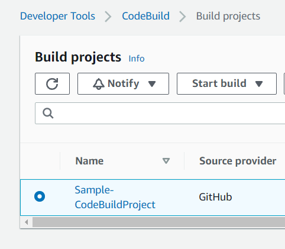
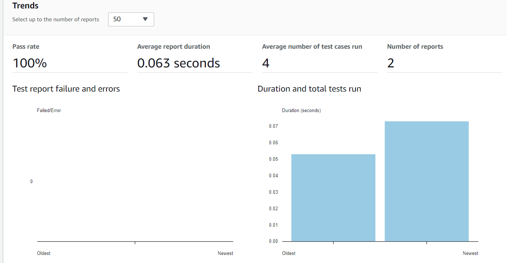

# simple-python-app
Simple Python App to experiment with AWS CodeBuild and Report groups

## About the App
Just a very basic app that has a function that accepts two numbers and adds them together.
There are two 'test_' files that both have 2 tests in them that work with pytest.
The build will run the unit tests and create a report file.  The build creates a file called test_results.xml using the JUNITXML format.

## Using this repo with AWS CodeBuild
- Create a stack using this CloudFormation Template: [codebuild.yml](https://github.com/kbrake42/simple-python-app/blob/main/cloudformation-templates/codebuild.yml)
  - Use this [link](https://docs.aws.amazon.com/codebuild/latest/userguide/access-tokens.html#access-tokens-github) to learn more about setting up access to the github repo
  - Note that if you want to use a github token then you can follow these steps before creating the stack:
    - Access CodeBuild from the console
    - Create a new build project
    - In the source section select GitHub as the Source provider
    - Select the 'Connect with a GitHub personal access token' option
    - In the 'GitHub personal access token' enter the GitHub personal access token
    - Click Save Token button
    - Under Connection Status if you see: "You are connected to GitHub using a personal access token." then you are good and can cancel the project creation.
    - You should now be able to create the stack
- Run the build
  - From the management console
    - Access the CodeBuild console
    - Access the Build Projects page
    - Select Sample-CodeBuildProject
    - Click 'Start build' button
    - Click 'Start now'
    - 
-  Check out the Unit Test Reports created during the build
    - Access the CodeBuild console
    - Access Report groups
    - Click the radio button next to Sample-CodeBuildProject-pytest_reports to select that Report group
    - Click the View Details button to see details about test runs
    - 

